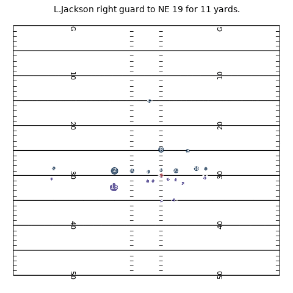
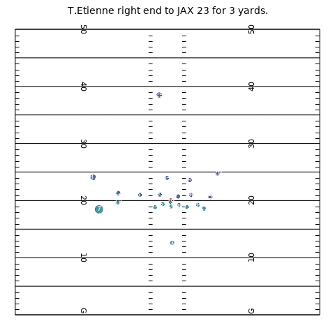
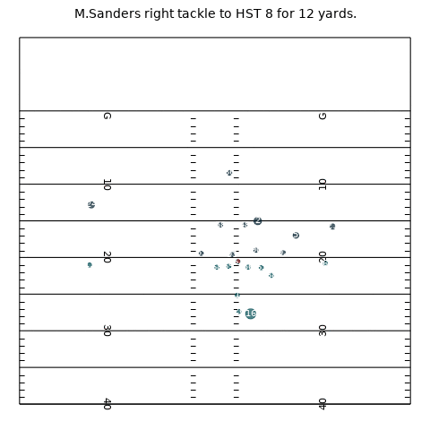
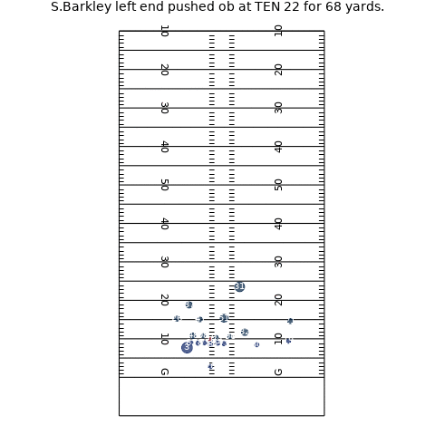

# Tackle Force Plot

While exploring 2023 NFL Big Data Bowl data, I created a function that creates gifs of individual plays. The size of each player's dot corresponds to their force (calculated as player mass x acceleration), while a dot turning green indicates the player is making a tackle and a dot turning pink indicates the player is engaging in a missed tackle. The function chooses a random run play out of the sample data provided by the NFL.

#Examples: 

